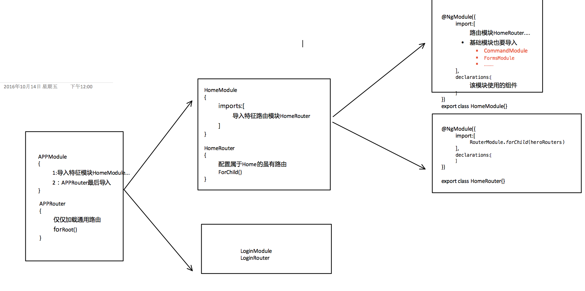

#<p style="text-align:center">angularJS2</p>

* 数据绑定

	|数据流动         | 语法| 说明|
	|--------------|---------------|---------------|
	|单向:数据源流向试图目标|1:{{express}} <br> 2:[target]="express" <br>3: bind-target="express"|1.插值 <br>2.Property(对象) <br>3.Attribute(节点) <br>4.类，样式|
	|单向：视图到数据源|(target)="事件"|事件|
	|双向|1:[(target)]="express" <br> 2:bindon-target="express"|双向|
	

	
	

	 <p style='color:#ff0000'>模板绑定是通过 property 和事件来工作的，而不是 attribute。<br>
	\* attribute 为节点(节点本身字符串)的属性 <br>
	\* property 为节点对象的属性
	<p>
* 模板语法

	* 插值<br>
		`
		<p>name:{{person.name}}</p>
		`
	* 属性（property）<br>
	
		```
			
			<button [disabled]="isUnchaneged">A</button>
			<hero-detail [hero]="currentHero"></hero-detail>
			......
		```
		* 绑定目标
		
			```
				
				
				
				绑定的是property 而不是attribute
				
				
				
				两者效果一致 
			```
		* 绑定attribute
			
			因为当元素没有属性可绑的时候，就必须使用 attribute 绑定。<br>
			默认情况下都是对property进行绑定<br>
			`<td [attr.colspan]="2"></td>`
		* css类绑定
		
			CSS 类绑定，可以从元素的class attribute 上添加和移除 CSS 类名。
			
			```
				<div class="AAA" [class]="BBB"></div>
				:当BBB有值时  值对应class会替代AAA这个class
				<div [class.special]="bool"></div>
				:增加或者移除special这个class
				
				操作多个Css
				<p [ngClass]="{className:bool,className:bool....}" >  </p>
				
			```
		* 样式绑定
			line内样式
			
			样式属性命名方法可以用中线命名法，font-size
			像上面的一样 也可以用驼峰式命名法fontSize
			
			```
				<button [style.color] = "isSpecial ? 'red': 'green'">Red</button>
				<button [style.background-color]="canSave ? 'cyan': 'grey'" >Save</button>
				有单位
				<button [style.font-size.em]="isSpecial ? 3 : 1" >Big</button>
				<button [style.font-size.%]="!isSpecial ? 150 : 50" >Small</button>
				
				操作多个样式
				<p [ngStyle]="{font-size:XX,color:BB}"></p>
			```
		
	* 事件绑定<br>
		等号左侧带圆括号的目标事件和右侧引号中的模板语句组成
		
		```
			<button (click)="onClick($event)"></button>
			<button on-click="onSave()">On Save</button>
			<input [value]="hero.name"
					(input)="hero.name = $event.target.value"
			>
			(这里指定的事件类型) （click）(input) (myevent)（...）
			自定义事件
				使用EventEmitter来自定义事件
				EventEmitter.emit(payload)来触发事件，可以传入任何东西作为消息载荷
				
				Component({
					selector:"test-com"
					template:
					'
						<button (click)="onSave()">
					'
				})
				class{
					deleRe = new EventEmitter<Class>();
					onSave(){
						this.deleRe.emit(this.classObj)
					}
				}
			<test-com (deleRe)="AA($event)">
			
			test-com 组件内部调用onSave() 函数 -->执行emit(target)--->调用关联事件AA	
				
		```
	* 数据双向绑定
	
		import { FormsModule}   from '@angular/forms';
		需要导入导入ngModel命令
		
		```
		(表单)语法糖:
			<input [(ngModel)]="writer.name">
			展开样式 适合做更多的事情
			<inpu  [ngModel]="currentHero.firstName"  (ngModelChange)="setUpperCaseFirstName($event)">
			
		* ngModel 不能运用在其他控件上 除非 你实现了 interface ControlValueAccessor	
			
			class MYComponent{
				@input()  size:number | string;
				@output() sizeChange:new EventEmitter<number>();
			}
		ex:	
			<mycom [(size)]>
		```
		
	
*  内置指令
	* ngModule
	
		import { FormsModule}   from '@angular/forms';
		
		imports:[FormsModule]
		
		[(ngModule)]="obj.name"  实现双向绑定   #AA= "ngModule" 绑定DOM
		
	* ngClass
		
		```
			单个class
			<div [class.special]="isSpecial">The class binding is special</div>
			多个class
			<div [ngClass]="{aclass:bool,bclass:bool}">This div is saveable and special</div>
		```
	* ngStyle
	
		```
			查看: 样式绑定 line内样式
		```
	* ngIf
	
       使用*ngIf="bool" 移除和添加DOM
		
		
		```
			<div *ngIf="currentHero">Hello, {{currentHero.firstName}}</div>
			
			angularjs  4
			1:  can = YES  显示div   Fasle 显示 elseB
				<div *ngIf="can;else elseB">AAA</div>
				<ng-template #elseB></ng-template>
				
			2: can = YES 显示B false C
				<div *ngIf="can;then B else:C"></div>
				<ng-template #B></ng-template>
				<ng-template #C></ng-template>
		```

	* ngSwitch
		
		```
		<span [ngSwitch]="toeChoice">
		  <span *ngSwitchCase="   'Eenie'  ">Eenie</span>
		  <span *ngSwitchCase="  'Meanie'  ">Meanie</span>
		  <span *ngSwitchCase="  'Miney'  ">Miney</span>
		  <span *ngSwitchCase="  'Moe'  ">Moe</span>
		  <span *ngSwitchDefault>other</span>
</span>
		```
		
	* NgForm
		
		```
			<form #thisF="ngForm" (onSubmit)="">
			
			</form>
		```
		
		
	* ngFor
		
		```
		<div *ngFor="let hero of heroes">{{hero.fullName}}</div>
			* ngFor="let one of heroes;let i = index/index as i"
				得到索引
			* ngFor="let one of heroes;last as _last"
				是否为最有一个
			* ngFor="let one of heroes;first as _first"
				是否为第一个
			*ngFor="let one of heroes;odd as _odd / even as _even"
				是否为奇/偶数index
			
		```
	* NGFORTRACKBY 提高ngFor性能
		
		```
		<div *ngFor="let hero of heroes; trackBy:trackByHeroes">({{hero.id}}) {{hero.fullName}}</div>
		trackBy:指定唯一标示
		trackByHeroes(index: number, hero: Hero) { return hero.id; }
		```
		
* 模板引用   
		
	对模板本身（任何标签）自身的引用  
	exam: phone	值得是`<input>`标签本身
	
	引用
		@ViewChild("name") one;
		   
	```
		1:<input #phone >
				{{phone.value}}
				
		2:<input ref-phone (input)=phoneChange(phone.value)>
		
		
	exam:
	
		<from (ngSubmit)="userSub(thisFrom)" #thisFrom="ngFrom">
			......
			<button type="submit" [disable]="!thisFrom.from.valid">
		</from>
		
		"ngFrom"是aj对from标签的包装，并给予更多的能力
		#thisFrom="ngFrom" thisFrom指的是包装之后的对象
		
		
	```

* 模板表达式（管道 过滤器）
	(|) (?) (&&)..
	
	```
		管道:  （ | ）
			{{name | uppercase | lowercase }}
			{{newDate | data:'longDate'}}
			{{ obj | json }}
		安全验证(保护):  (?)
			在无法包装数据是否存在时 如果不进行保护会使试图渲染失效
			the title is {{currentHero.title}}  如果currentHero为空时 视图渲染出错
			this title is  {{currentHero?.title}}	
			
	
	```
* 根模块app/app.module.ts
	
	```
		import { NgModule }      from '@angular/core';
		import { BrowserModule } from '@angular/platform-browser';
		@NgModule({
		  imports:      [ BrowserModule ],
				当应用需要模块的特性时，将其添加到imports数组中。
				"只要" 在根模块AppModule中导入BrowserModule。除非是惰性的
				* 只能导入NgModule类 不能为其他
				
		  providers:    [ Logger ,自定义服务],
		  		声明全局服务  (优先吧服务注册在module 而不是组件中)
		  		只要是在@NgModule申明的服务 都是全局的
		  declarations: [ AppComponent ],
		  		 声明。    Angular：组件、指令和管道 所有的必须导入
		  entryComponents:
		  				动态插入的组件
		  exports:      [
		  		作为特性模块 必须将这个模块的东西导出 给root模块使用
		   		AppComponent 指令....
		   ],
		  
		  bootstrap:    [ AppComponent ]
		  		指定应用的主视图（称为根组件）
		})
		export class AppModule { }
	```
	

	


* 依赖注入

	注入器维护一个内部的令牌-提供商映射表，这个映射表会在请求依赖时被引用到
		<div style="color:red;text-align:center">	{ServaClass/[OpaqueToken]:ServeObj依赖值 ,.....}</div>
		<div style="color:red">
			<div>1:注册器和Dom层级完全一致,每个组件都有注册器</div>
			<div>2:当该层级没有该提供商,会找其父类 直至ROOT__</div>
			<div>3:每个提供商都要有唯一标示 通常服务都是用Class作为标示</div>
			<div>4:如果是非类提供商，就要是用OpaqueToken 包装</div>
		</div>
	
	```
		1：创建服务
			@Injectable() 标识一个类可以被注入器实例化
		
		2：为注入器 指定提供商
			简写:
					[LoginServe]
			ClassProvider:
						{provide: useClass: multi:true 扩展已有}
			ExistingProvider:   
						[
							BB,
							{provide:AA useExisting:BB}
							AA 为BB的 别名
						]
			FactoryProvider:   
						{provide: useFactory:工厂 deps: multi:}
			ValueProvider:    
						{provide:OpaqueToken  useValue: multi:}			
			
		
			@ngModel({providers:[...]})  为应用级别注入器  指定可以注入的服务
												整个应用使用一个单利
			@Component({providers:[...]}) 组件级别注入器 指定可以注入的服务
												每个组件都有独自的服务
					[HEroServer]
					[{provide: HEroServerC, useClass: HEroServerC}]
					[{provide:HEroServerC,userClass:SubHEroServer}] 使用HEroServer服务时  真实注入的是SubHEroServer服务
					[ NewLogger,{ provide: OldLogger, useExisting: NewLogger}]	当旧组件想使用OldLogger记录消息时，我们希望改用NewLogger的单例对象来记录。
					
					
					
		//工厂提供商  指定 注册服务 的创建函数  （特殊）
			let Factory=(依赖的服务)=>{
				return 服务对象；
			}
			export let servPro = 
					{ 
					   provide: HeroService,   指定返回的服务Class
					   useFactory: Factory,    指定创建服务的工厂
				      deps: [Logger, UserService]  依赖的服务
  					};
			注册服务 使用servPro   providers:[servPro]
		//非类依赖   （字符串，函数，实例） 
			import { InjectionToken } from '@angular/core';
			exports MAinURL=new InjectionToken<T>("随意")
			
			{providers:[{provide: MAinURL,useValue:anyValue}]}
			import {Inject} from '@angular/core';
			constructor(@Inject(MAinURL) private url:T){}			
			
			
		3：依赖注入
			constructor(private serve: MYServer) { }
		4:控制继承方式
			默认子组件注册的服务会从根组件一直继承
			constructor(
				@Host()   表示MYServer只从宿主组件继承  没有就会报错
				@Optional()    在宿主组件没有该服务  只是设置为null 不报错
				private serve: MYServer) { }
_
@Self() - 表示只在本级注入器查找依赖对象
@SkipSelf() - 表示不从本级注入器获取依赖对象
@Optional - 表示该依赖对象是可选的，如果找不到返回 null
	```
* 路由

	`
		<base href="/">
	`

	```
		A:
			import { RouterModule, Routes } from '@angular/router';
			
			RouterModule  路由模块
			Router        管理从一个组件到另一个组件的导航   服务  (用于进行导航)
			Routes        路由数组 [Route]
			Route         单个路由
			RouterOutlet    <router-outlet></router-outlet> 显示不同的导航页面
			
			RouterLink    指定跳转的连接 
							
									
			RouterLinkActive  指定当前连接的样式    routerLinkActive="clickA"  指定激活和未激活css样式
								[routerLinkActive]      [routerLinkActive]="['',...]"
								子路由被激活 那么父路由默认也被激活  指定 routerLinkActiveOptions={ exact: true} 将会精确绑定
								
			[routerLinkActiveOptions]="{ exact: true }"    仅仅上路由完全匹配才会触发 激活样式
			
			ActivatedRoute    服务 包含特定路由信息 ( 一站式获取路由信息 参数。。)
				
			RouterState
		B:
			Route {
				path?: string;
				pathMatch?: string;
				matcher?: UrlMatcher;
				component?: Type<any>;
				redirectTo?: string;
				outlet?: string;    router-outlet name 用于多个区分
				canActivate?: any[];
				canActivateChild?: any[];
				canDeactivate?: any[];
				canLoad?: any[];
				data?: Data;
				resolve?: ResolveData;
				children?: Routes;
				loadChildren?: LoadChildren;
			}
			配置路由:
				URL匹配是一节一节向下匹配的

			const appRoutes: Routes=[
				{path:"home",component:HomeComponent}
				{path:"meet",component:MeetComponent}
				{
					path:"meet/:id",
					component:MeetComponent,
					canActivate:[守卫服务]表示是否容许导航
					canActivateChild:[能否导航到子路由]
				}
				{
					path:"",
					<!--component:MeetComponent-->
					redirectTo:"hh"
					pathMatch:"full" 重定向
				} 空 首页
				{path:"**",component:HomeComponent}  当URL无法匹配任何一个，通用路由 放置最后
			]
			
			子路由  
				路由必须在<router-outlet></router-outlet>下显示
				routes:Route[]=
				[
					{
						path:"meet",
						component:MeetCenterComponent,  如果没有children   192.0.0.1:3000/meet  显示的就是该组件
						children:[    子路由
							{
								path:"",      有了children MeetCenterComponent 必须有router-outlet 来显示子路由
												并且192.0.0.1:3000/meet 会加载MeetListCompoent组件
								component:"MeetListCompoent"
								children:[ 二级子路由
										{
											path:"" MeetListCompoent必须有router-outlet
											component:WelcomeComponent
										},
										{
											path:":id"  192.0.0.1:3000/meet/12 
											component:DetailComponent
										}
								]
							}
						]
					}
				]
			192.0.0.1:3000/meet 	MeetCenterComponent/MeetListCompoent/WelcomeComponent
			192.0.0.1:3000/meet/1     MeetCenterComponent/MeetListCompoent/DetailComponent
				
			主页: 192.0.0:3000==> 192.0.0:3000/index
		     	 {
				    path:"",
				    redirectTo:"/index",
				    pathMatch:"full"
				  }
			通用界面:(错误界面/默认界面/主页)  无匹配的URL
				{
					path:"**",
					redirectTo:"/index",
				}
			
		C:路由模块
			见下图
			
		CC:第二路由
			1：<router-outlet></router-outlet>
				默认是无名路由 outlets对象是无需的
			2：<router-outlet name="popup"></router-outlet>		
			{
				path:"message",
				component:AABB,
				outlet:"popup"
			}
			导航:(指定路由 在popup入口处显示message路由)
				1:<a [routerLink]="[{ outlets: { popup: ['message'] } }]">Contact</a>
				2:setTimeout(()=>{this.router.navigate([{outlets:{popup:["message"]}}])},2000)
			3: 第二路由（http://www.bauda.com/syu/2(popup:message))
				AA(有第二路由)
				BB
				在AA/BB 之前切换时 即使改变主路由 第二路由依然存在（很奇怪）
				第二路由出现，无论怎么改换主路由 第二路由不受影响(这或许就是相互独立吧)
			4：清除第一路由
				this.router.navigate([{outlets:{popup:null}}])
			
			
		D:守卫   是否可以导航进入
			canActivate    路由守卫 协议
			canActivateChild.. 子路由守卫协 议
			
			@Injectable()
			export class Auth implements  CanActivate| canActivateChild...{
				canActivate(route: ActivatedRouteSnapshot, state: RouterStateSnapshot){
					return 可观察<bool> | Promise<bool>|bool
				}
			}
			{
				path:"",
				component:AAA,
				canActivate:[Auth]  当前是否可以激活
				canActivateChild:[Auth...],  保护所有子路由
			}
			
			
		E:未修改的守卫 CanDeactivate协议   是否可以退出路由
			 全局同一接口:
				1:定义同一接口<A> ---> 需要守卫的组件实现该接口
				2:创建服务实现CanDeactivate<A>
				3:服务实现方法
					canDeactivate(component:实现A的组件, route: ActivatedRouteSnapshot, state: RouterStateSnapshot): Observable<boolean> | Promise<boolean> | boolean;{
							实现A的组件->接口函数
							容许  return true
							不容许 return false
					}
				4:在需要的组件中加入守卫
				
					>interfaceA
					>ComponentB importents A
					>Guard守卫 importents CanDeactivate<ComponentB>
					>路由加入
			单独:
					>Guard守卫 importents CanDeactivate<ComponentB>
					>路由加入
					
		 G:预先得到组件数据
		 	场景 在得到组件数据之后 在渲染组件
		 	1:定义服务AAA实现  Resolve<DataType>
		 		resolve(route: ActivatedRouteSnapshot, state: RouterStateSnapshot): Promise<Crisis> ||
		 		获取数据
		 	2:
		 		Route{
		 			path:"",
		 			resolve:{
		 				xx:AAA
		 			}
		 		}
		 	3:ngOnInit(){
				//数据已经得到 才加载组件
				ActivatedRoute.data.subscribe(data:{xx:DataType}=>{
				
				})
		 	}
		 	
		 
		 F:	懒惰路由 CanLoad守卫
		 	***  懒惰加载的模块中注册的服务 是局部的 不能全应用使用
		 	*** 需要重新导入 CommonModule / FormsModule...
		 	
		 	>对{path:"",children:[{....}]} 才有效
		 	> 之前的 canActivate 、canActivateChild 路由守卫仅仅控制路由 （模块文件 已经被加载）
		 	> CanLoad守卫 是在加载前进行操作（模块文件没有被加载）
		 	
		 	创建服务 实现CanLoad
		 	
		 	1:在父级中 imports中移除加载该模块
		 	2:在 父级路由路由 中设置
		 		{
		 			path:"admin",
		 			loadChildren:"app/admin/admin-module#AdminModule"
		 			//指定模块文件路径 和 需要加载的模块
		 			canLoad:[CanLoad]
		 			//懒加载守卫
		 		}
		 	3:修改本模块路由
		 		[
		 			{
		 				path:'',  admin //置空
		 				component:AdminComponet
		 				children:[
		 					自路由  不改变
		 				]
			 		}
		 		]
		 		
		 	
		G: 预加载  在必须加载模块完成后 进行必要模块预加载
				> 1:过程和 惰性加载模块一致
				> 2:在根路由
					RouterModule.forRoot([], {preloadingStrategy:PreloadAllModules})
		 			这样会加载所有( 预加载模块 和 惰性模型)
		 			你可以添加canLoad 来阻止其预加载（使其为惰性加载）
		 		> 3:有两种预加载策略
		 			A:都不加载（m默认）
		 			B:都加载PreloadAllModules
		 			
				 	自定义预加载策略
						>定义服务AAA 实现PreloadingStrategy
						preload(route: Route, load: () => Observable<any>): Observable<any> {
								Route{
									path:""
									...
									data:{pre：true} 自定义是否加载
								}
								if(需要 route.data && route.data["xx"]){
									return load();
								}else{
									returrn Observable.of(null);
								}
						}
						>RouterModule.forRoot([], {preloadingStrategy:AAA})
			
		D:API
			可以的服务：
				ActivatedRoute：一站式获得路由信息 可以得到当前路由组件的一切信息
					url: 该路由路径的Observable对象。它的值是一个由路径中各个部件组成的字符串数组。
					data: 该路由提供的data对象的一个Observable对象。还包含从resolve守卫中解析出来的值。
					params: 包含该路由的必选参数和可选参数的Observable对象。
					queryParams: 一个包含对所有路由都有效的查询参数的Observable对象。
					fragment: 一个包含对所有路由都有效的片段值的Observable对象。
					outlet: RouterOutlet的名字，用于指示渲染该路由的位置。对于未命名的RouterOutlet，这个名字是primary。
					routeConfig: 与该路由的原始路径对应的配置信息。
					parent: 当使用子路由时，它是一个包含父路由信息的ActivatedRoute对象。
					firstChild: 包含子路由列表中的第一个ActivatedRoute对象。
					children: 包含当前路由下激活的全部子路由。
					
				Router:进行路由导航的服务
					router.navigate(["/home",路由或者参数]) 
						绝对导航 
							192.0.0.168:3000/home
							192.0.0.168:3000/home/占位符参数
							192.0.0.168:3000/home;name=xx,age=00
						
					router.navigate([12],{ relativeTo::ActActivatedRoute })
						相对导航 
							如果当前url:http://www.baidu.com/student
							-> http://www.baidu.com/student/12
							
							
					router.navigate(["../"],{ relativeTo:ActActivatedRoute })
						相对导航  回到上级
					router.navigate(["../list"])
						兄弟导航
						
					navigateByUrl总是绝对导航
					
				锚点导航:			
					<a routeLink="['aa']" ></a> 都是相对导航
				
				
		E:导航 / 参数的传递
	
		1: URL 传递参数 （URL体现 httP://www.a.com/student/1 ）
		
		{path:"stu_detail/:id",component:DeatilComonent}
			<a [RouterLink]='["home",12]'> 连起来
			===><a [RouterLink]='["/home/12"]'>
			this.router.navigate(["/stu_detail",id])//必要参数
			--->this.ActivatedRoute.params
			
		2: URL 传递参数（URL不体现 httP://www.a.com/student;name=xx...）
		
			{path:"stuent",component:ListComonent}
			this.router.navigate(["/stuent",{name:xx,age:11}])
			//可选参数 http://localhost:8000/stu_list;name=xx;age=11
			--->this.ActivatedRoute.params
			
		3: 导航传递 第二个参数
			this.router.navigate(["crisis"],NavigationExtras:{
				queryParams:{}， 参数  ？name=xx..
				fragment:"key",  片段   ..#top
				
				
				//指定这两个参数 会把当前参数 继续在路由中传递
				//preserveQueryParams: true, 参数传递
				queryParamsHandling:'merge' | 'preserve' | '';
				
			   preserveFragment: true   片段传递
			   
			   
			   skipLocationChange: true  不会产生历史记录
			}）	
			
			ActivatedRoute.queryParams.map(params => params['session_id'])....
		
	```
组装：
	


	

*  用户输入  / 表单
	
	* 用户输入
		
		```	
		1:<input (input/keyup)="inputC($event)">
		
		2:<input #inpV (input/keyup)="input(inpV.value)">
		
		```
	* 表单
	
		模板驱动表单   (用户的输入会时时绑定到数据中)
		
		表单里面所有输入控件必须有name属性
		
		```
			1: 导入 import { FormsModule }   from '@angular/forms';
			2: 加入@NgModule imports数组
			
			<form (ngSubmit)="subFrom()" #thisF = "ngForm">
				<input type='text' name="input名称必须的" [(ngModel)]="" #nameI ="ngModel" requird minLength='' maxLength="">
				<div *ngif="!name.valid">
					
				</div>
				.....
				<button type='submit' [disable]="!thisF.form.valid">提交</button>
			</form>
			
			css class
				.ng-untouched{为点击}
				.ng-touched{点击}
				.ng-dirty{值改变}
				.ng-invalid{无效}
				.ng-valid{无效}
				exam：
					  /**输入有效 */
					  .ng-valid[required], .ng-valid.required {
					    border-left: 5px solid green;
					  }
					  /**输入无效 */
					  .ng-invalid:not(form){
					    border-left:5px solid #a94442;
	  				 }
			#thisF 
				变量指的是所在的DocumentObject
				
			#thisF="ngForm" / #nameI="ngModel"   
				变量指的是经过aj包装后的DocumentObject
			验证:
				thisF.form.valid
				name.errors.required/minlength/maxlength
				name.valid
		```
	数据驱动 动态表单  （没有数据双向绑定,在用户提交时进行绑定）
	
		```
			import { ReactiveFormsModule }   from '@angular/forms';
			@ngModule imports: [... ReactiveFormsModule ],
			
			import { FormControl, FormBuilder:表单构造,FormGroup, Validators：验证s} from '@angular/forms';

			是根据数据动态生成表单
				formGroup          把HTML 和组件对象绑定
				formControlName    把HTML 和formGroup某个控件绑定
				只是提供对Form操作的方便
				
			
				1:根据数据创建FromGroup
					A:
						let group:any={
						//子控件
							keyID1:new FormControl(value,Validators.required)
							keyID2:new FormControl(value2,[Validators.required,Validators.minLength(4),API,自定义验证函数,AAAAA(reg)])
							....
						}
						let myF = new FromGroup(group);
					B:
						注入FormBuilder
						this.fb.group({
							keyID1:[value,验证函数|[验证s]],
							keyID2:[value,验证函数|[验证s]],
							....
						})
					
				2:绑定form和子控件
					<form [formGroup]="myF">
						根据数据创建form子控件
							<input [id]="" [name]='' [formControlName]=keyID/>
					</form>
					
				3:注意 表单的渲染 必须在formGroup对象创建之后  
				4:验证
					在创建FormControl 要指定验证函数Validators.required。。。。
					this.form.controls[KEYID].valid
					this.form.valid
					this.form.controls[ID].errors   错误消息
		```
自定义验证:
		
		```
		    自定义验证函数: 全局
				import { AbstractControl, ValidatorFn, Validators } from '@angular/forms';
				export function AAAAA(nameRe: RegExp):ValidatorFn {
					//返回验证函数 
			  		return (control: AbstractControl): {[key: string]: any} => {
			   			retun 有效:null,输入无效：{"msg":"错误消息"}
			   			
			  		};
				}
			自定义验证指令：
				import { Directive, Input, OnChanges, SimpleChanges } from
				'@angular/core';
				
				import { AbstractControl, NG_VALIDATORS, Validator,
				ValidatorFn, Validators } from '@angular/forms';
				
				@Directive({
				   selector: '[forbiddenName]',
				   providers: [{provide: NG_VALIDATORS, useExisting:
				   MYDirective, multi: true}]
				   	扩展系统验证框架 NG_VALIDATORS
				})
				
				export class MYDirective implements Validator, OnChanges {
					@Input() forbiddenName: string;  //[forbiddenName]=xxx
					ngOnChanges(changes: SimpleChanges): void {
					
					}
					validate(control: AbstractControl): {[key: string]: any}
					{
						return 返回验证函数
					}
				}
				
				<input  [forbiddenName]="bb">
		
		```


* HTTP  JsonP  ------ > HttpClientModule
	
	```	
		1：import { HttpModule, JsonpModule } from '@angular/http';
				import { Observable }     from 'rxjs/Observable';

		2：加入@NgModule({imports:[HttpModule, JsonpModule]}) 全应用级别
		3: import { Http, Response , Headers} from '@angular/http';
    	   import 'rxjs/add/operator/toPromise';
			exam:创建自己的数据服务
				export class DataServe{
					constructor(private http: Http) { }
					getData:Promise{
					
		   			   pro = this.http.get(url).toPromise()
		   			   pro.then(resopne=>resopnse.json() as Hero[])
		   			   pro.catch(()=>{
		   			   		return Promise.reject(msg)//拒绝
		   			   })
						return	 pro;
					}
					//
					getData():Observable<Hero[]>{
						this.http.get(url)
						.map(res:Resoponse=>res.json().myInfo as Hero[])
						.catch(err:Response=>{
							return Observable.throw(err.message)
						})
					}
				}
				
			
			use:使用
				Oninit(){
					this.dataServe.getData().then(data=>this.hero=data)
				}
				
				
		this.http.get(url)-----> Observable<Resopnse>对象
		
	A:	get(url: string, options?: RequestOptionsArgs): Observable<Response>;
			let pars = new URLSearchParams();
		    pars.set("name","zzh");
		    
			get(url,{seach:pars ,headers:...})
		
	B: post(url: string, body: any, options?: RequestOptionsArgs): Observable<Response>;
			let cush = new Headers({ 'Content-Type': 'application/json' });
			post(url,bo,{seach:..,headers:cush})
		
	跨域
			import { Jsonp, URLSearchParams ,RequestOptions} from '@angular/http';
			constructor(private jsonp: Jsonp) {}
			
			//只有get 方法
			let params = new URLSearchParams();
		    params.set('search', term); // the user's search value
    		params.set('action', 'opensearch');固定
    		params.set('format', 'json');固定
    		params.set('callback', 'JSONP_CALLBACK');固定
    		//seach ...位于RequestOptions
			this.jsonp.get(url,{seach: params,headers:..})
			
	修改默认请求头信息
		1: A extends  BaseRequesrOptions
		2: 修改默认信息
			this.hears.set("Content-Type","application/json")
			...
		3:修改{ provide:RequestOptions,useClass:A }
	
	```
* HttpClientModule

	```
	https://angular.cn/guide/http
	
	import {HttpClientModule} from '@angular/common/http';
	imports:[HttpClientModule]
	
	constructor(private client: HttpClient) {}
	
	
	API：
		HttpRequest <T>
			url
			method
			请求信息
				{
					body?: any;
					headers?: HttpHeaders;
					observe?: 'body'; 觉得回调 参数是什么类型
						response | body | events
						响应对象    响应结果  所有事件HttpEvent						
					params?: HttpParams;
					reportProgress?: boolean; 是否提供进度 注意 是否打开 和UI 堵塞
					responseType: 'arraybuffer'; 觉得Result展现
						'arraybuffer' | 'blob' | 'json' | 'text'
					withCredentials?: boolean;
				}
			
		HttpEvent<T>	请求事件
			HttpSentEvent    请求发送事件
			HttpHeaderResponse  头响应信息
			HttpResponse<T>       请求完成事件
			HttpProgressEvent  	进度信息
			（HttpDownloadProgressEvent、HttpUploadProgressEvent）
			HttpUserEvent<T>   用户定义的事件
			
		HttpResponse<T>
			状态
			事件类型  HttpEvent
			。。。。
			
		参数 POST 请求体
			post 默认提交数据为 "name=xx;age=ass"
				content-type:"application/x-www-form-urlencoded"
			URLSearchParams  进行处理
				dic-> URLSearchParams -> toString
				
		GET
			new HttpParams().set('id', '3'),
			===>	http://sasasa.com?id = 3&...
		、
		、
重要: 请求 和 响应 说明
		1:默认所有结果都是JSon
		2: JSon请求时 结果转换
				interface  MYModel{
					hehe:;
					points:string[]
				}
			request<MYModel>--->data data为MYModel对象
		3:其他数据返回
				request(url,method,{responseType: 'text'}).sub(data:string)
		4:请求回调 你可决定何种 形式 何种 类型
			1:所有事件回调  observe:"events"
			2:HttpResponse 回调 observe:'response'
			3:仅仅关系结果 及结果形式    observe:'body' / responseType:"josn...."
		
	1:基础
		client.request<T>(HttpRequest)->Observable<HttpEvent<T>>会在以上事件发生后触发

		client.request(url,method,ops)
	2:常规操作 默认进行JOSN解析（内部都是对'基础'操作进行封装）
		A:(Base func) get<T>(url: string, options: {  T 是你自己定义类型
        		headers?: HttpHeaders;
        		observe: 'events';   
        		params?: HttpParams;
        		reportProgress?: boolean;
        		responseType?: 'json'; 
        		withCredentials?: boolean;
        	}): Observable<HttpEvent<T>>;
       B:	get(url: string, options: {
        		headers?: HttpHeaders;
        		observe?: 'body';    
        		params?: HttpParams;
        		reportProgress?: boolean;
        		responseType: 'text';
        		withCredentials?: boolean;
		    }): Observable<string>;
		    、
请求 响应拦截
	1：认证
	2:参数同一设置 响应拦截
	3:日志 
	4:缓存 
	
	import {HTTP_INTERCEPTORS} from '@angular/common/http';
	{provide: HTTP_INTERCEPTORS,useClass: NoopInterceptor,multi: true}
	
	example:
		import {Injectable} from '@angular/core';
		import {HttpEvent, HttpInterceptor, HttpHandler, HttpRequest} from '@angular/common/http';
		@Injectable()
		export class AuthInterceptor implements HttpInterceptor {
		  intercept(req: HttpRequest<any>, next: HttpHandler): Observable<HttpEvent<any>> {
		  	 //req  当前请求
		  	 //改变请求 必须clone()  HttpRequest 为不可变
		  	 //重新 配置请求
     		 let authReq = req.clone({
     		 	method:'GET',
     		 	....
     		 })
     		 //掉下一个拦截器
		    return next.handle(authReq);
		    
		    /** 日志
		    	const start = new Date()
		    	return next.handle(req).do((event)=>{
		    		if(event instanceof HttpResponse ){
		    			const end = new Date();
		    			end - start
		    		}
		    	})
		    */
		    
		    /**
		    	//缓存  cache自己编写
		    	let oldres = this.cache.get(req);
		    	let maybeCachedResponse: Observable<HttpEvent<any>> = ob.empty
		    	if (oldres){
		    		maybeCachedResponse = Ob.of(oldres)
		    	}
		    	const networkResponse = next.handle(req)
		    	networkResponse.do(()=>{
		    		//进行缓存
		    	})
		    	return Observable.concat(oldres, networkResponse)
		    */
	  }
	}
	
	监听进度事件	
		const req = new HttpRequest('POST', url, file, {
		  reportProgress: true,
		});
		this.http.request(req).sub((event)=>{
			if(event.type == HttpEventType.UploadProgress){
			event.loaded / event.total
			}else if(event inof HttpResponse){
				完成
			}
		})
	```


* 模块  NgModule

	```
	1:组件，指令，管道 只能声明一次   只属于一个模块
	2:模块是相互独立的
		> 通过导出 提供给其他模块使用
		> 共享注入器  服务是公共的 (惰性加载除外)
		> 组件自己的服务是独立的
	3: exports:[] 提供其他模块使用   否则不能使用
```
* 特性模块

	```
	一个app 只能有一个rootModule 当时可以有很多特性模块
	ionic 就是一个特性模块
	
	你可以把一个单独的模块 比如说某一功能设置为特性模块 然后在root中包含它
	
	```


* 安全
	
	```
		1： 当值从模板中以属性（Property）、DOM元素属性（Attribte)、CSS类绑定或插值表达式等途径插入到DOM
			HTML:直接插入HTML式无效的   ex:<div [innerHTML]=""></div>
			样式: 值需要作为CSS绑定到style属性时使用
			URL：值需要被用作URL属性时使用，比如<a href>
				exam:  <a href="obj.url"></a>  这将是无效的
					<a [href]="obj.url">   有效
		   资源URL：值需要被当做代码而加载并执行时使用
		2:模板中的代码 默认为可信任的 不要根据用户输入 动态生成模板源码
		3：尽量避免直接使用DOM API
		4：安全策略
			如果HTML插入的值包含javaScript代码  插入的值将会无害化处理
		5：被信任的
			bypassSecurityTrustScript      把带有js代码变为信任的
			bypassSecurityTrustUrl          
			bypassSecurityTrustResourceUrl  把网址变为可信任的
			
			import { DomSanitizer, SafeResourceUrl, SafeUrl } from '@angular/platform-browser';
			
			constructor(private sanitizer: DomSanitizer) {
			    this.dangerousUrl = 'javascript:alert("Hi there")';
			    this.trustedUrl:SafeUrl = sanitizer.bypassSecurityTrustUrl(this.dangerousUrl);
			   //<a class="e2e-trusted-url" [href]="trustedUrl">Click me</a>
			   
			   this.videoUrl:SafeResourceUrl=this.sanitizer.bypassSecurityTrustResourceUrl(this.dangerousVideoUrl);
			   //<iframe  width="640" height="390" [src]="dangerousVideoUrl"></iframe>
  			}
			
	```

* 速查表

	|	类装饰器	|import { Directive, ... } from '@angular/core';|
|--------|--------|
|@Component({...}) class MyComponent() {}	|声明当前类是一个组件，并提供关于该组件的元数据。declarations|
|@Directive({...}) class MyDirective() {}	|声明当前类是一个指令，并提供关于该指令的元数据。declarations|
|@Pipe({...}) class MyPipe() {}	|声明当前类是一个管道，并且提供关于该管道的元数据。declarations|
|@Injectable() class MyService() {}	|声明当前类有一些依赖，当依赖注入器创建该类的实例时，这些依赖应该被注入到构造函数中。providers|


	| 组件配置	| @Component扩展了@Directive, 以便@Directive中的配置项也能用在组件上|
|----|------|
|moduleId: module.id	| 如果设置了，templateUrl和styleUrl会被解析成相对于组件的。|
|providers: [MyService, { provide: ... }]|依赖注入provider的数组，局限于当前组件的视图中。|
|template: 'Hello {{name}}'<br>templateUrl: 'my-component.html'|当前组件视图的内联模板或外部模板地址|
|styles: ['.primary {color: red}']<br>styleUrls: ['my-component.css']|内联CSS样式或外部样式表URL的列表，用于给组件的视图添加样式。|

	|供指令类或组件类用的字段装饰器。	|import { Input, ... } from '@angular/core';|
	|-----|----|
|@Input() myProperty;	|声明一个输入属性，以便我们可以通过属性绑定更新它。(比如： <my-cmp [my-property]="someExpression">).|
|@Output() myEvent = new EventEmitter();|声明一个输出属性，以便我们可以通过事件绑定进行订阅。(比如：<my-cmp (my-event)="doSomething()">).|
|@HostBinding('class.valid') isValid;	|改变宿主属性 class 有无，attr.xx;class.XX;style.xx|
|@HostListener('click|document:click', ['$event']) onClick(e) {...}|监听宿主事件； 通过指令/组件的方法(例如onClick)订阅宿主元素的事件(例如click)，可选传入一个参数($event)。 （指令-属性指令）|
|@ContentChild(myPredicate) myChildComponent;|把组件内容查询(myPredicate)的第一个结果绑定到类的myChildComponent属性。  ngAfterContentInit 之前完成 <br>针对占位符ng-content内的子组件|
|@ContentChildren(myPredicate) myChildComponents;|把组件内容查询(myPredicate)的全部结果，绑定到类的myChildComponents属性。|
|@ViewChild(Class) c:Class;|在子组件构建之后 保存最前面一个的组件(某一类型)。（获取 #one 引用） 对指令无效/针对组件。ngAfterViewInit 之前赋值|
|@ViewChildren(Class)cs:Class[];|在初始子组件之后 把某一类型的组件保证为数组。对指令无效/针对组件。|
	
		
		
		
小东西:

```
必须了解 组件/ 服务作用域
	1:服务是全局的 不管你在哪个模块中声明的
		> 惰性加载的模块服务是局部的 
		> 组件内部声明的服务是局部的  自己和子组件
	2:模块内部组件仅仅对内部可以使用 
		> 可以通过模块导出 @NgModule({exports:[]})
```

```
惰性加载模块
	1：该模块服务无法共享
	2：自己组件无法导出共享
	3：无法使用其他模块导出组件
	
	>可以吧惰性模块 必要的组件/服务 注册到根模块上
```

```
导入第三方库 （js + css）  这里指的是不能typing导入的库

	1:在index.html 导入第三库js
	2:如果同时要导入 css 要根据情况是导入模板css文件中  还是通过link 导入模板中
		>由于模板css编译会自动增加  css[_ngcontent-c0]条件
		>如果库 使用js 创建class 
		就会有冲突 （这里可以通过直接链接 模板 html 中 link 导入 css）
	
```

```
	css 样式导入
		1:分为单独文件 同一目录下
			component
				ts
				html
				scss
			@Component({
				templateUrl:"xx.html" 即可
			}）
		2：内联
			A.html 文件中  <style>...</style>//<link></link>
			B.ts中 styles=[``,``]
			C.ts中  styleUrls=[....]是相对app下的路径
			
			
```

```
Angular 数据更新策略
		https://segmentfault.com/a/1190000008754052
```

```
关联的值不时时更新   没有触发检查事件
 
 输入框输入：
	<input #box >
	{{ box.value }}
	当输入后 并不会更新值 这是因为angular并不得到响应 不会更新
	
	<input #box (keyup)="0">
	{{ box.value }}
	(keyup)="0"  angular 不知道他在干嘛  但是触发更新流程
	
 强制检查更新
 	import {ChangeDetectorRef} from '@angular/core';  
 	private changeDetectorRef:ChangeDetectorRef 
 		markForCheck() - 在组件的 metadata 中如果设置了 		changeDetection: ChangeDetectionStrategy.OnPush 条件，
 						那么变化检测不会再次执行，调用强制更新数据
		detach() - 从变化检测树中分离变化检测器，该组件的变化检测器将不再执行变化检测，除非手动调用 reattach() 方法。
		reattach() - 重新添加已分离的变化检测器，使得该组件及其子组件都能执行变化检测
		detectChanges() - 从该组件到各个子组件执行一次变化检测 
```

```
组件的动态创建：
	移除之前的组件代码 ， 创建新的
	上面有实例
```
```
双向数据绑定
		1:一般仅仅表单控件才能使用双向数据绑定 这是因为angularjs为表单控件实现了ControlValueAccessor协议
		2:如果你为div 增加 [(ngModel)]="XX" 会有 
		"No value accessor for form control with unspecified name attribute"类似的错误
		这是因为他不知道如何去绑定你赋予的值
				
实现自定义组件 满足双向数据绑定 
	ControlValueAccessor
		writeValue(obj: any): void;
  		-> 外部设置值改变 触发
  			if(obj){
  				this.value = obj;
  			}
  			
  		registerOnChange(fn: any): void
  		-> 外部设置触发函数   你可以保留 并在必要使调用
  			(ngModelChange)="XX()"	
  				
   	 	registerOnTouched(fn: any): void;
   	 	->  外部设置Touched事件

	   setDisabledState?(isDisabled: boolean): void;
		->  外部设置该组件 是否可用
		
example:
		@Component({
		  selector:"counter",
		  template:
		`
		 <div class="form-group">
		    <div>{{count}} </div>
		    <div (click)="add()">++1</div>
		    <div (click)="reduce()">--1</div>
		    <br>
		</div>
		`,
		  providers:[EXE_COUNTER_VALUE_ACCESSOR]
		})
		
		export class CounterComponent implements ControlValueAccessor{
		  count:number;
		  changeFun:Function;
		  add(){
		    this.count+=1;
		    this.changeFun(this.count);
		  }
		  reduce(){
		    this.count-=1;
		    this.changeFun(this.count);
		  }
		  
		  writeValue(obj: any){
		    if(obj){this.count = obj;}
		  }）
		  registerOnChange(fn: any){
		    this.changeFun = fn ;
		  }
		  registerOnTouched(fn: any){}
		  setDisabledState?(isDisabled: boolean){}
		}

以上仅仅完成 组件编写 Angular 还需要进行注册
	import {Component, Input,forwardRef} from '@angular/core';
	import {ControlValueAccessor,NG_VALUE_ACCESSOR} from "@angular/forms";

	let EXE_COUNTER_VALUE_ACCESSOR: any = {
		  provide: NG_VALUE_ACCESSOR,
		  useExisting: forwardRef(() => CounterComponent),
		  multi: true
		  
		  
		  forwardRef: 解决在定义前使用对象的问题
	};
	
	注册在上面示例中
	

```

```
ng-template 和 ng-container
	ng-template：
		<ng-template>
			这里面是不显示的 		
		</ng-template>		
		<ng-template [ngIf]='true'> 不能使用糖语法
			这里面就会显示的 		
		</ng-template>
		
		可用作占位符 动态插入组件
		
	ng-container：
		本身作为逻辑容器    对节点进行分组 本身不做显示
		
```

```
组件相关类

	ElementRef
	TemplateRef
	组件类
	ViewContainerRef
	
TemplateRef & ViewContainerRef   Renderer

	AnagularJs 模板基于
		Template 模板元素
		Component 组件
	
	nativeElement->ElementRef->TemplateRef
	
	注入得到
		@ViewChild("") AA:ElementRef/TemplateRef
		@ViewChild("",{read:ViewContainerRef}) AA: ViewContainerRef
		或者
		constructor(
			ElementRef
			TemplateRef 不能注册
			ViewContainerRef
		){}
	
	TemplateRef模板引用(注入)
		ElementRef 元素 封装 HTML
			nativeElement   HTML节点
		createEmbeddedView() 创建内部视图  ViewRef_
		
	ViewContainerRef 组件容器（注入）
		封装TemplateRef 提供便利方式进行组件操作
		1:视图个数
		2:模板
		3:createEmbeddedView（结构指令）
			基于TemplateRef创建并添加内嵌视图，并自动添加到视图容器中，可通过index设置
		4:createComponent
			基 ComponentFactory创建并添加组件视图ComponentFactoryResolver
		5:对子组件的 移除 索引 销毁操作哦
		
	Renderer
		对节点 ELement 进行渲染
		增加节点 Attribute / property   /text /class ...
		事件监听 通过EventManager 注册事件
```	
* 自定义结构指令

```
@Directive({
  selector:"[range]"
})
export class RangeDirective{
  _range:number[];
  @Input() set range(value:number[]){
    // debugger
    let _nums:number[] = [];
    for (var i = value[0];i<value[1];i++){
      _nums.push(i);
    }
    this._range = _nums;
    //清除现有组件
    this.con.clear()
    this._range.forEach((value,index)=>{
      //第二个参数为 NgForRow 对象 用于上下文传递值
      this.con.createEmbeddedView(this.tel,{
        $implicit:value
      })
    })

  }
  constructor(private tel:TemplateRef<any>,private con:ViewContainerRef){
    // debugger
  }
}

<div *range="[0,10];let num">
    <p>11111--{{num}}</p>
</div>
```
```
事件绑定  自定义事件
	AngularJS  支持事件冒泡（父组件 可 接受子组件 事件）
		$event.stopPropagation() 停止冒泡
		$event.preventDefault()取消默认操作  不能停止冒泡
	自定义指令 不支持冒泡  注意销毁
		@Directive({
		  selector:"[click.stop]"
		})
		export class StopEventPropagation implements OnInit,OnDestroy{
		  @Output("click.stop") stopPropEvent = new EventEmitter<Event>();
		  constructor(private render:Renderer,private ele:ElementRef){}
		  unobserver:Function;
		  ngOnInit(){
		  	//监听事件 取消
		    this.unobserver = this.render.listen(this.ele.nativeElement,"click",(event)=>{
		      event.stopPropagation()
		      this.stopPropEvent.emit(event);
		    })
		  }
		  ngOnDestroy(){
		    //不在监听事件
		    this.unobserver()
		  }
		}
	<button (click.stop)="AA()"></button>
```

```
事件管理EventManager
	：在 Angular 中所有的事件绑定都是由一个事件管理器来驱动，事件管理器本身由多（3）个事件插件提供支持
	
	HammerGesturesPlugin - 处理手势（EventManagerPlugin）  优先级 高
	KeyEventsPlugin - 处理键盘事件（EventManagerPlugin）  优先级 中
	DomEventsPlugin - 处理 DOM 事件 （EventManagerPlugin） 优先级 低 （Dom能处理所有事件）
	
	默认：
		EVENT_MANAGER_PLUGINS:令牌
	{provide: EVENT_MANAGER_PLUGINS, useClass: DomEventsPlugin, multi: true},
    {provide: EVENT_MANAGER_PLUGINS, useClass: KeyEventsPlugin, multi: true},
    {provide: EVENT_MANAGER_PLUGINS, useClass: HammerGesturesPlugin, multi: true}
	{provide: EVENT_MANAGER_PLUGINS, useClass: 我的事件处理插件, multi: true}   这将是最高的
	
EventManager：
	维护 一个插件列表（3个） 和 一个缓冲查找记录（{"click":Plugin}...）	
	addEventListen(){
		A:得到支持事件的插件
			1:缓冲查找
			2:列表查找    supports（）
			3:保存缓冲
		B:调用插件addEventListen方法
	}
	
EventManagerPlugin：插件
	manager: EventManager;   管理者
	abstract supports(eventName: string): boolean;是否支持事件名
	addEventListener(element: HTMLElement, eventName: string, handler: Function): Function;
    addGlobalEventListener(target: string, eventName: string, handler: Function): Function;
    
自定义自己的插件  支持 （click,mouseover）= "aa()"

Class CustomPlugin extened EventManagerPlugin{
	supports(eventName: string): boolean{
		//click,mouseover   多个
		//由于内部不进行实际注册 而是再次交给管理者注册
		//为避免循环这里  必须进行正确判断
		return YES/NO
	}
	addEventListener(element: HTMLElement, eventName: string, handler: Function): Function{
		查看AJ2源码的
		let zone = this.manager.getZone();
        let eventsArray = 对事件分割 得到数组
        let outsideHandler = (event: any) => zone.runGuarded(() => handler(event));
        return this.manager.getZone().runOutsideAngular(function () {
        // 为了简单自己不做处理 直接交给管理者 再次注册
        eventsArray。forEach{
        	this.manager. addEventListener(...)
        }
	}
}

providers: [
    { provide: EVENT_MANAGER_PLUGINS, useClass: MultiEventPlugin, multi: true }这里注册的优先级是最高的 先查找自定义的
  ],
    
    
https://segmentfault.com/a/1190000009156250
```

```
 解决ion-content可以上下拉动一点距离问题  滚动
 	在ion-content 标签下有 <div class="scroll-content"></>
 	存在css  overflow-y: scroll; 导致可以上下拉动
 		
 @Directive({
  selector:"[base-content-no-scroll]"
})
export class BaseContentNoScroll{
  constructor(
    private ele:ElementRef,
  ){}
  ngOnInit(){
    let scroll_ele = this.ele.nativeElement.querySelector(".scroll-content");
    scroll_ele.style.overflowY = "hidden";
  }
}
注册：
	declarations:[] 数组中
使用:
	<ion-content base-content-no-scroll>
	</ion-content>
 
```
